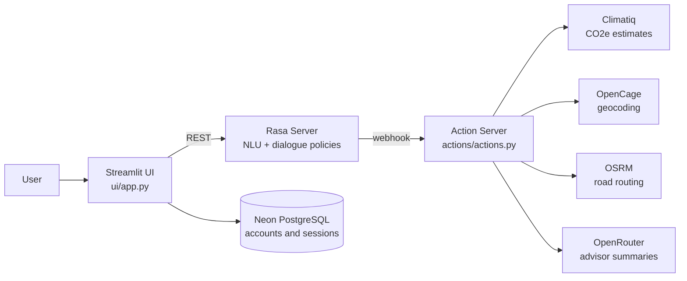

# Eco-Travel Advisor

A conversational travel assistant that helps you plan lower-carbon trips across Europe. It collects your route, dates, budget and sustainability priority through natural dialogue, then compares transport options using real emission data and recommends the plan that best fits how much you care about cost versus climate.

Built with Rasa 3.6 for dialogue management, a Streamlit front end with user accounts, and live integrations for emissions, geocoding, routing and LLM summaries.

[](https://colab.research.google.com/github/gokhanpasli/eco-travel-advisor/blob/main/notebooks/colab_demo.ipynb)


<!-- Add a screenshot or short GIF of the Streamlit UI here. A 10 second GIF of a full conversation is the single best thing you can show. -->
<!--  -->

## What it does

- Guides you through a trip planning conversation: origin, destination, dates, budget, trip type and how strongly you weight sustainability
- Estimates door-to-door CO2e per transport mode (train, bus, car, flight) using the Climatiq API, with distance and driving routes from OSRM and geocoding from OpenCage
- Handles real-world routing quirks, including ferry corridors for island destinations and offline fallbacks when a public API is slow or unavailable
- Scores and ranks the options with weights that shift based on your stated sustainability preference, then adds accommodation and cultural suggestions
- Lets you review and change any detail mid-conversation without restarting, with confirmation and cancel flows
- Generates a concise advisor summary of the chosen plan through OpenRouter, and can hand off to a human advisor
- Persists user accounts and sessions in a Neon serverless PostgreSQL database behind a cookie-authenticated Streamlit interface

## Architecture



The NLU pipeline uses spaCy embeddings (`en_core_web_md`) with DIET for intent classification and entity extraction. Slot filling runs through a validated Rasa form, and every external call has a timeout, a cache and a deterministic fallback so a slow third-party API degrades the answer instead of breaking the conversation.

## Quickstart

### Option 1: Google Colab (no local setup)

Click the Colab badge above, add your API keys to Colab Secrets, and run the cells top to bottom. The notebook clones this repository, trains the model and serves the UI through a public ngrok link. Setup and training take roughly 10 to 15 minutes.

### Option 2: Docker

```bash
cp .env.example .env   # fill in your API keys
make docker-train      # trains the model inside the Rasa container
make docker-up         # starts the action server, Rasa and the UI
```

Then open http://localhost:8501.

### Option 3: Local (Python 3.10)

```bash
python3.10 -m venv .venv && source .venv/bin/activate
make install
cp .env.example .env   # fill in your API keys, then: export $(grep -v '^#' .env | xargs)
make train
make run-actions       # terminal 1
make run-rasa          # terminal 2
make run-ui            # terminal 3
```

## Configuration

All secrets are read from environment variables. Nothing is hardcoded.

| Variable | Purpose |
|---|---|
| `CLIMATIQ_API_KEY` | Carbon emission estimates |
| `OPENCAGE_API_KEY` | Geocoding of free-text city names |
| `OPENROUTER_API_KEY` | LLM-generated advisor summaries |
| `NEON_DATABASE_URL` | PostgreSQL connection for user accounts |
| `AUTH_COOKIE_SECRET` | Signs the Streamlit login cookie |
| `RASA_BASE_URL` | Rasa server URL for the UI (defaults to localhost, set automatically by docker-compose) |

The assistant still works with missing keys: emissions fall back to built-in per-mode factors and routing falls back to haversine estimates, so the conversation never dead-ends.

## Evaluation

The model is tested at three levels of increasing strictness, all reproducible with `make evaluate`:

1. **Held-out NLU test set** (`tests/test_nlu.yml`), examples excluded from training
2. **Five-fold cross-validation** over the full NLU data, to check the held-out score is not a lucky split
3. **Blind NLU test set** (`tests/final_test_nlu.yml`), written after the model was finalized, plus **Core test stories** for dialogue-level correctness

| Evaluation | Accuracy | Macro F1 |
|---|---|---|
| Held-out NLU (51 examples) | 0.961 | 0.962 |
| 5-fold cross-validation (mean, 313 examples) | 0.690 | 0.700 |
| Blind NLU (68 examples) | 0.882 | 0.877 |
| Core test stories (dialogue level) | 1.000 (7/7 stories, 14/14 actions) | — |

**Reading these numbers honestly.** The gap between the held-out score
and cross-validation is the interesting part: per-fold training reaches
1.000 accuracy, so the classifier overfits a small dataset, and the CV
confusion matrix shows the loss is concentrated in near-synonymous
`provide_*` intents (origin vs. destination vs. general trip details)
and in the origin/destination entity pair, which are genuinely
ambiguous without dialogue context ("Berlin" could be either). In
production these are not resolved by the classifier alone: the slot
form maps them from dialogue state, which is why the dialogue-level
Core evaluation passes 100% while isolated intent classification does
not. The blind set, written after the model was finalized, lands
between the two as expected.

## Project structure

```
├── actions/            # Custom action server: APIs, scoring, recommendation logic
├── data/               # NLU examples, rules, stories
├── tests/              # Held-out and blind NLU sets, Core test stories
├── ui/                 # Streamlit app: auth, chat interface, results view
├── scripts/            # Evaluation suite and Colab runners
├── notebooks/          # One-click Colab demo
├── docker/             # Dockerfiles for the action server and UI
├── config.yml          # NLU pipeline and dialogue policies
├── domain.yml          # Intents, entities, slots, responses
└── docker-compose.yml  # Three-service local deployment
```

## Design decisions and limitations

- **Rasa over a pure LLM agent.** Slot filling, validation and confirmation flows are deterministic and testable, which matters when the output drives a purchase-like decision. The LLM is used only where it adds value: summarizing an already validated plan.
- **Prototype assumptions are explicit.** Car costs use a typical petrol car (6.5 l/100 km, 1.80 EUR/l) and prices per mode are heuristic estimates, not live fares. These constants sit at the top of `actions/actions.py` and are easy to swap for a fares API.
- **European city scope.** The city index covers major European destinations; free-text input outside the index falls back to OpenCage geocoding.
- Planned next: live fare integration, multi-leg journeys, and splitting `actions/actions.py` into smaller modules with unit tests around the scoring logic.

## License

MIT. See [LICENSE](LICENSE).
